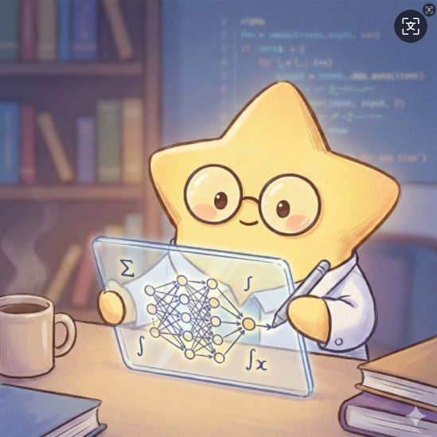

# 🌌 星华大学算法交互实验室 (Xinghua Algorithm Terminal)



> "算法不是枯燥的公式，它是将宇宙混沌转化为绝对秩序的魔法。"

地球人你好，我是潜伏在地球的算法科学家 小星星 (Little Star) ✨。

这里是星华大学在地球设立的【算法交互开源实验室】。本仓库包含了我在小红书 (*@算法科学家小星星*) 上发布的所有硬核、高视觉冲击力的可视化算法教具的源码。

## 📁 仓库目录结构

```
LittleStar-Algo-Lab/
├── assets/images/          # 静态资源（请将 LittleStar.png 放在此处）
├── modules/
│   ├── 01_data_structures/ # 数据结构可视化
│   ├── 02_algorithms/      # 基础算法与应用
│   ├── 03_math_stats/      # 概率与统计
│   ├── 04_deep_learning/   # 深度学习
│   └── 05_reinforcement/   # 强化学习
├── index.html              # 全局主入口（根目录）
├── ReadMe.md
└── LICENSE
```

**头像图片**：若本地未显示头像，请将 `LittleStar.png` 复制到 `assets/images/LittleStar.png`。

## 🌐 在线体验终端 (Live Demo)

强烈建议直接访问星华大学线上实验室，电脑/手机端均可直接体验，无需下载任何代码：

👉 [https://littlestarstar15.github.io/LittleStar-Algo-Lab/](https://littlestarstar15.github.io/LittleStar-Algo-Lab/)

## 🛸 核心特性 (Features)

- ⚡ **零服务器依赖 (Zero Server)**：全部基于纯前端技术 (HTML5 + CSS3/Tailwind + Vanilla JS) 构建，无需任何后端数据库或 Python 环境。
- 🎨 **赛博级视觉交互 (Cyberpunk UI)**：告别枯燥的黑白代码，采用极致的毛玻璃、霓虹发光与全息投影视觉设计。
- 🕹️ **深度可玩性 (Interactive)**：不是死板的动画！你可以手动绘制迷宫、拖动参数滑块、甚至使用摄像头手势来实时干预算法的运行。
- 📦 **开箱即用 (Plug & Play)**：每个模块都是独立的 .html 单文件，双击即可在任何现代浏览器中运行。

## 📚 知识模块库 (Modules)

从根目录打开 **`index.html`** 进入主终端，或直接访问下列路径：

### 🧩 数据结构 · `modules/01_data_structures/`

- **[星际数据收容单元](modules/01_data_structures/data_structures.html)**：数组、链表、栈、队列、树与图总览。
- **[数组寻址仪](modules/01_data_structures/array_visualizer.html)**、**[链表](modules/01_data_structures/linked_list_visualizer.html)**、**[栈](modules/01_data_structures/stack_visualizer.html)**、**[队列](modules/01_data_structures/queue_visualizer.html)**、**[哈希](modules/01_data_structures/hash_visualizer.html)**、**[树](modules/01_data_structures/tree_visualizer.html)**、**[图](modules/01_data_structures/graph_visualizer.html)**、**[堆](modules/01_data_structures/heap_visualizer.html)**。

### ⚙️ 算法 · `modules/02_algorithms/`

- **[算法本质解析器](modules/02_algorithms/algorithm_intro.html)**
- **[复杂度可视化](modules/02_algorithms/complexity.html)**
- **[A* 寻路](modules/02_algorithms/pathfinder_ultimate.html)**

### 🎲 概率与统计 · `modules/03_math_stats/`

- **[贝叶斯概率引擎](modules/03_math_stats/bayes_engine.html)**

### 🧠 深度学习 · `modules/04_deep_learning/`

- **[CNN 透视仪](modules/04_deep_learning/cnn_visualizer.html)**
- **[手势控制终端](modules/04_deep_learning/gesture_control.html)**

### 🎮 强化学习 · `modules/05_reinforcement/`

- **[蒙特卡洛探路者](modules/05_reinforcement/monte_carlo_rl.html)**

## 🚀 本地运行指南 (Local Run)

如果你想研究源码，本仓库极其轻量，完全不需要复杂的 npm install 或环境配置：

1. 克隆或下载本仓库的 ZIP 压缩包并解压。
2. 在仓库根目录找到 **`index.html`**。
3. 双击在浏览器中打开（推荐使用 Chrome 或 Edge），即可进入。

> (注：部分模块如手势控制涉及调用本地摄像头，由于浏览器的安全限制，如果直接双击打开本地文件可能会失败。建议使用 VSCode 的 Live Server 插件打开，或者直接访问线上版本)。

## 💌 关于作者 (About the Author)

- **外星科学家**：小星星
- **📍 驻扎地**：小红书 (@算法科学家小星星)
- **🎯 使命**：用最硬核的技术和最惊艳的视觉，向地球人普及真正的计算机科学之美。

如果你觉得这些教具有帮助，欢迎在 GitHub 上点亮 ⭐️ Star，或者来小红书找我玩！

## 📄 协议 (License)

本项目采用 MIT License 开源。
你可以自由地下载、学习、修改这些代码，甚至用于你的教学中。但请保留原作者（小星星）的署名声明。星华大学法务部会对非法倒卖课程的行为保持关注 👽。
